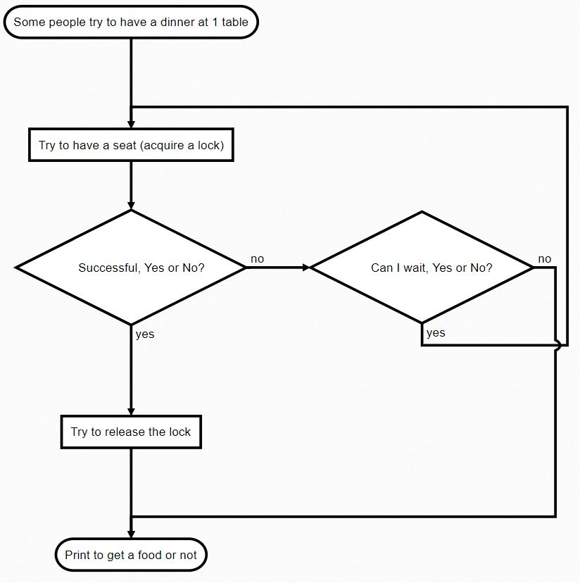

# Playing with distributed locks using Redis

This small .Net Core application is an example to acquire locks in a distributed system.
Nowadays, you can easily scale your (microservices) system and you can have shared resources.

The good old solution, using the lock statement is not appropriate to manage the accessibility between distributed applications.

#### Resources

- C# Corner: [Creating Distributed Lock With Redis In .NET Core](https://www.c-sharpcorner.com/article/creating-distributed-lock-with-redis-in-net-core).
- [An example](http://taswar.zeytinsoft.com/redis-running-in-docker/) of using different data types (string, hash, list).
- Other solutions on the [official page](https://redis.io/topics/distlock). 
- [Observer design pattern](https://docs.microsoft.com/en-us/dotnet/standard/events/observer-design-pattern) unsubscribe mechanism to release the lock.
- Using the [Polly library](https://github.com/App-vNext/Polly) to wait and retry to acquire a lock.

#### Clients

- [StackExchange.Redis](https://github.com/StackExchange/StackExchange.Redis): Most popular and stable client. Interface for [IDatabase](https://github.com/StackExchange/StackExchange.Redis/blob/master/src/StackExchange.Redis/Interfaces/IDatabase.cs).
- [StackExchange.Redis.Extensions](https://github.com/imperugo/StackExchange.Redis.Extensions): This library extends StackExchange.Redis. [IRedisDatabase](https://github.com/imperugo/StackExchange.Redis.Extensions/blob/master/src/StackExchange.Redis.Extensions.Core/Abstractions/IRedisDatabase.cs).

>  Try out [distributed cache with Redis](https://github.com/19balazs86/PlayingWithDistributedCaching).

#### Code snippets
```csharp
public interface ILockFactory
{
    ILockObject AcquireLock(string key, TimeSpan expiration, int retryCount = 0, TimeSpan sleepDuration = default);
    
    Task<ILockObject> AcquireLockAsync(string key, TimeSpan expiration, int retryCount = 0, TimeSpan sleepDuration = default, CancellationToken cancelToken = default);
}
```

```csharp
public interface ILockObject : IDisposable
{
    // Did I get a lock or not?
    bool IsAcquired { get; }

    // Release the lock, if it still exists and returns true, otherwise false.
    bool Release();

    Task<bool> ReleaseAsync();
}
```

#### Setup a redis server on Windows.

1. Download the redis server (zip version) from [MicrosoftArchive/redis/releases](https://github.com/MicrosoftArchive/redis/releases)
2. Run the server: redis-server.exe
3. Run the client (optional): redis-cli.exe | [Redis commands](https://redis.io/commands)

Install it from: [Chocolatey Galery](https://chocolatey.org/packages/redis-64).

#### This flowchart is represent the steps.


